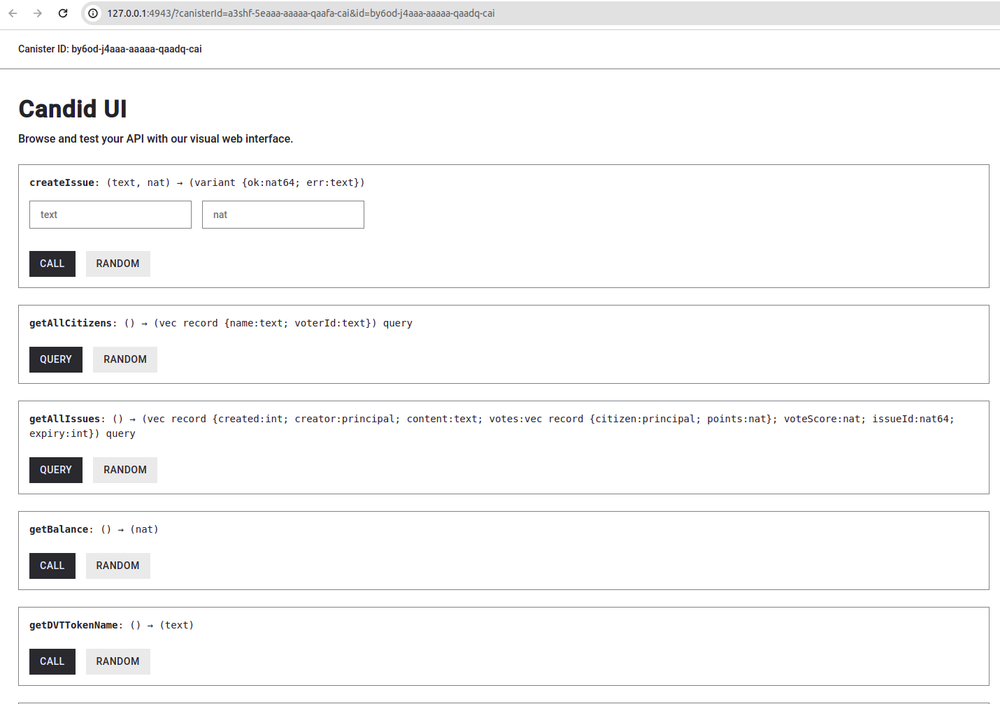
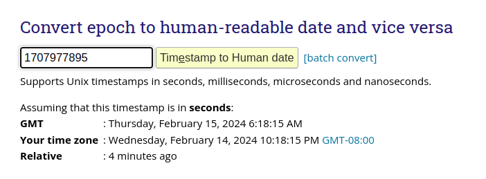
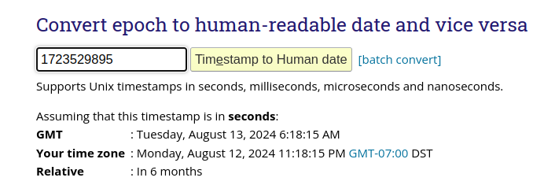
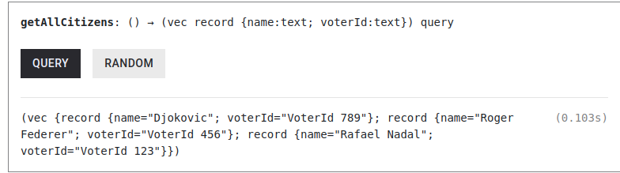
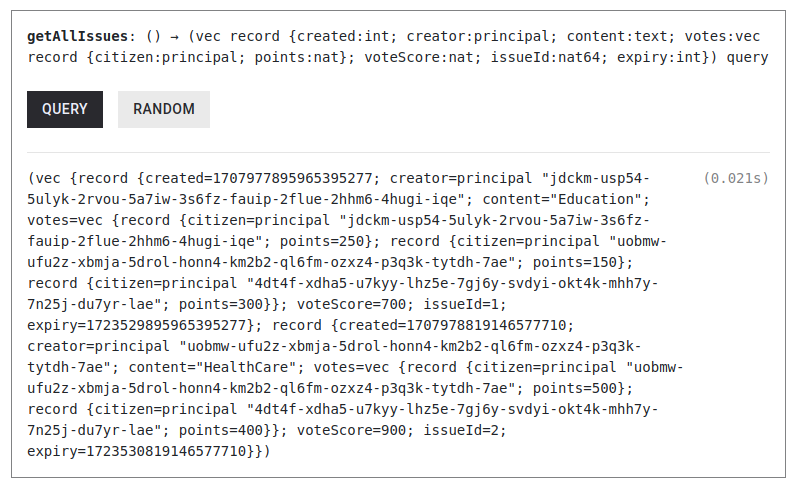
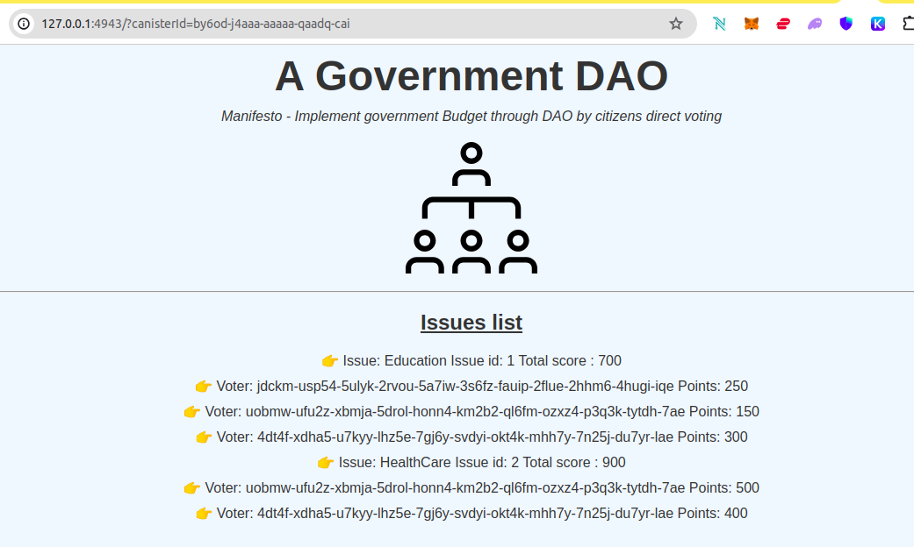

# Government Budget DAO


### Project Overview

This project introduces a groundbreaking approach to governance and public budget allocation through a Decentralized Autonomous Organization (DAO) model, built on the Internet Computer Protocol (ICP) and utilizing the Motoko programming language. By enabling citizens to vote directly on key issues such as Education, Healthcare, Welfare, and Infrastructure, this initiative aims to democratize decision-making processes and ensure that government spending aligns more closely with the public's priorities.

### The Need for Change in Government Budget Allocation

Traditionally, government budget allocation is a top-down process, often lacking in transparency and direct public involvement. Citizens vote for representatives or political parties based on their platforms, but once in office, there is limited accountability for how decisions align with the electorate's preferences. This disconnect can lead to inefficiencies, misallocation of resources, and a general sense of disenfranchisement among the populace.

### Advantages of a DAO Model for Governance

#### **Direct Democracy and Increased Participation**

A DAO model facilitates a more direct form of democracy, allowing citizens to vote on specific issues rather than just choosing representatives. This can increase engagement and give the public a more significant say in how resources are allocated, ensuring that government actions reflect the will of the people.

#### **Transparency and Accountability**

Blockchain technology inherently provides a transparent and immutable record of transactions and decisions. By applying this to government budgeting and decision-making, it ensures that every allocation and its justification are publicly accessible, fostering greater accountability from decision-makers.

#### **Security and Trust**

The decentralized nature of blockchain technology reduces the risk of fraud and corruption, as altering recorded information would require consensus across multiple nodes. This enhances trust in the government's budgeting process, as citizens can verify transactions and decisions independently.

#### **Efficiency and Reduced Bureaucracy**

DAOs can streamline decision-making processes, reducing the need for extensive bureaucratic oversight and potentially lowering administrative costs. By automating certain aspects of the governance process through smart contracts, resources can be allocated more quickly and efficiently to where they are needed most.

### Implementation Challenges and Considerations

While the benefits of a DAO-based governance model are significant, there are also challenges to consider, such as ensuring broad and equitable access to the technology, preventing manipulation or undue influence in the voting process, and integrating this new model with existing legal and governmental frameworks.

### Conclusion

By adopting a DAO model for government budget allocation, we can create a more transparent, accountable, and participatory system of governance. This project represents a step towards realizing that vision, leveraging the power of the ICP and blockchain technology to empower citizens and ensure that government spending aligns with the public's priorities. As we move forward, it will be crucial to address the implementation challenges and work towards a system that truly reflects the will of the people.

This README aims to provide a comprehensive overview of the project's goals, benefits, and considerations. As this project evolves, we welcome contributions, discussions, and feedback from the community to refine and improve this model for democratic governance.


The project comprises two main components: the DAO actor and the token actor, along with a types module that defines shared data structures. Here's a summary of each component and their functionalities:

### DAO Actor (`actor DAO`)

[DAO actor code](https://github.com/rchak007/governmentDaoICP/blob/main/src/dao/main.mo)

The DAO actor is the core of the project, facilitating the creation of issues (proposals) that citizens can vote on, registering citizens, and managing votes. It interacts with the token canister to handle the minting and burning of tokens as a means of voting power.

**Key Functionalities:**

- **Citizen Registration:** Allows new citizens to register, granting them an initial amount of tokens (1000 DVT (Government Dao voting tokens) tokens as per the `registerCitizen` function) to participate in voting. A citizen needs to provide their Voter Id to be able to register. 
- **Issue Management:** Any Citizen can create new issues (`createIssue`) for others to vote on. Each issue includes a content description, creator information, creation time, expiry, and votes.
- **Voting:** Citizens can vote on issues by allocating tokens (`voteIssue`). Votes are transparent, showing the amount of tokens each citizen has allocated to an issue. When a citizen votes with tokens they are burnt and their balance reduces.
- **Token Interaction:** Interacts with the token canister to mint and burn tokens based on citizen activities such as registration and voting.
- **Information Queries:** Provides functions to query DAO details (`getDaoName`, `getManifesto`), citizen details, and issue details (`getAllIssues`, `getIssue`).
- **Web Interface:** Implements an `http_request` function to serve a webpage displaying the DAO's manifesto, name, and a list of issues along with their votes, using a simple HTML template.

### Token Actor (`actor DVTToken`)

[Token Actor code](https://github.com/rchak007/governmentDaoICP/blob/main/src/token_faucet/main.mo)

The token actor manages the custom token (DVT) used for voting within the DAO. It supports basic token functionalities such as minting, burning, transferring, and querying balances.

**Key Functionalities:**

- **Token Information:** Provides the token's name (`Government Dao Voting Token`) and symbol (`DVT`).
- **Minting and Burning:** Allows the DAO to mint new tokens for new citizens or burn tokens when they vote on issues.
- **Balance Management:** Citizens can query their token balance (`balanceOf`) or transfer tokens to another principal (`transfer`).
- **Supply Queries:** Enables querying the total supply of tokens in circulation (`totalSupply`).

### Types Module (`module` in `types.mo`)

[types.mo](https://github.com/rchak007/governmentDaoICP/blob/main/src/dao/types.mo)

Defines common data structures used by the DAO actor, such as `Citizen`, `Vote`, `Issue`, and various types related to HTTP requests and responses. This modular approach ensures type safety and consistency across the DAO and token actors.


## Scope and Future improvement

Right now the project has basic capabilities. 

- Voter ID - right now we just accept this without any checks. But the future vision is that we can make an API call to verify some basic KYC and maybe have some Decentralized identity coming directly from the Government participation.

- Final results - right now project just takes votes on an issue created and after 6 months no more votes are accepted. But for now there is no more follow up on this. But in future we need to move this to budget finalized state etc. 

- It was decided arbitrarily the 1000 tokens for now. Also we need a way to restart the process in the following year etc. Right now each identity gets only 1000 but if there are subsequent years then its not handled yet.

- does not have capability to change manifesto. in future there can be more break down also on each Issue/Area to provide more content and options to vote.

- Currently citizen can vote multiple times but functionality to reduce their own votes after voting is not built.

  


## Deploying locally and Testing


we create few multiple users for testing:

```
chakravarti@chakravarti-Latitude-7280:~/ICP/MotokoBootcamp/dao-government$ dfx identity list
anonymous
chakravartiICP1 *
citizen1
citizen2
citizen3
default
test1
tester1
```


### Re-install for clean tests

Since we have `stable` variables defined for a clean re-test we install the canisters with re-install options.

```bash
dfx canister install dao --mode=reinstall
dfx canister install token --mode=reinstall


chakravarti@chakravarti-Latitude-7280:~/ICP/MotokoBootcamp/dao-government$ dfx canister install dao --mode=reinstall
WARNING!
You are about to reinstall the dao canister
This will OVERWRITE all the data and code in the canister.

YOU WILL LOSE ALL DATA IN THE CANISTER.


Do you want to proceed? yes/No
yes
Reinstalling code for canister dao, with canister ID by6od-j4aaa-aaaaa-qaadq-cai
chakravarti@chakravarti-Latitude-7280:~/ICP/MotokoBootcamp/dao-government$ dfx canister install token --mode=reinstall
WARNING!
You are about to reinstall the token canister
This will OVERWRITE all the data and code in the canister.

YOU WILL LOSE ALL DATA IN THE CANISTER.


Do you want to proceed? yes/No
yes
Reinstalling code for canister token, with canister ID avqkn-guaaa-aaaaa-qaaea-cai
```


### deploy locally


```bash
chakravarti@chakravarti-Latitude-7280:~/ICP/MotokoBootcamp/dao-government$ dfx deploy
Deploying all canisters.
All canisters have already been created.
Building canisters...
WARN: .mops/base@0.10.2/src/Principal.mo:80.20-80.32: warning [M0154], field append is deprecated:
`Array.append` copies its arguments and has linear complexity;

WARN: .mops/base@0.10.2/src/Principal.mo:80.20-80.32: warning [M0154], field append is deprecated:
`Array.append` copies its arguments and has linear complexity;
/home/chakravarti/ICP/MotokoBootcamp/dao-government/src/dao/main.mo:241.72-241.84: warning [M0154], field append is deprecated:
`Array.append` copies its arguments and has linear complexity;

Installing canisters...
Module hash ffe44e05213e8032b6878e0f2eabf0ab0e4617caa630e4ffc2e7fdaa31e23123 is already installed.
Module hash b6dc5303780db1178f28bcfc2500517cc6aac76f89b65ba253c5efadf8a17f82 is already installed.
Deployed canisters.
URLs:
  Backend canister via Candid interface:
    dao: http://127.0.0.1:4943/?canisterId=a3shf-5eaaa-aaaaa-qaafa-cai&id=by6od-j4aaa-aaaaa-qaadq-cai
    token: http://127.0.0.1:4943/?canisterId=a3shf-5eaaa-aaaaa-qaafa-cai&id=avqkn-guaaa-aaaaa-qaaea-cai
```


With this we can also look at the Candid UI for our `dao` canister.

### candid UI for `dao` canister




### Unit Testing


| Summary of testing and validations                           |
| ------------------------------------------------------------ |
| A user has to be registered as Citizen to be able to create an Issue or Vote. Anyone can create Issue to be voted on. |
| User/Citizen gets 1000 voting tokens very first time they register and can only use that to vote on different issues. If an issue is more important to a user they can use more Voting tokens on that issue. after they vote those tokens are burnt and their balance is reduced. |
| When issue is created like example Education the user will also establish their initial votes on it. |
| Citizen can vote multiple times even on same issue- so each time their votes keep getting added |
| Each Issue will keep track of all the voters who voted with their total votes and also a summed vote count to make it easy to know final total. |


First we do some negative tests and also some general info etc without really creating any citizen, issue etc  Just as some simple tests


#### Test 1 - Try to create issue w/o being a citizen yet - should Error

First we identify the identity just to document it so we keep track of which identity we are testing as.  

```bash
chakravarti@chakravarti-Latitude-7280:~/ICP/MotokoBootcamp/dao-government$ dfx identity whoami
chakravartiICP1
chakravarti@chakravarti-Latitude-7280:~/ICP/MotokoBootcamp/dao-government$ dfx canister call dao whoami '()'
(principal "jdckm-usp54-5ulyk-2rvou-5a7iw-3s6fz-fauip-2flue-2hhm6-4hugi-iqe")
```


Now below we see that this results in error.

```bash


dfx canister call dao createIssue '("Education", 100)'

chakravarti@chakravarti-Latitude-7280:~/ICP/MotokoBootcamp/dao-government$ dfx canister call dao createIssue '("Education", 100)'
(variant { err = "NotDAOCitizen" })


```


#### Test 2 - Check Voting Token info

This will be in inter canister call where the `token` canister is called to get the info.

We get the Token Symbol and Token Name which are:

`DVT - Government Dao Voting Token`

```

chakravarti@chakravarti-Latitude-7280:~/ICP/MotokoBootcamp/dao-government$ dfx canister call dao getDVTTokenSymbol '()'
("DVT")

chakravarti@chakravarti-Latitude-7280:~/ICP/MotokoBootcamp/dao-government$ dfx canister call dao getDVTTokenName '()'
("Government Dao Voting Token")


```


#### Test 3 - Check our DAO name and manifesto


```
chakravarti@chakravarti-Latitude-7280:~/ICP/MotokoBootcamp/dao-government$ dfx canister call dao getDaoName '()'
("A Government DAO")


chakravarti@chakravarti-Latitude-7280:~/ICP/MotokoBootcamp/dao-government$ dfx canister call dao getManifesto '()'
(
  "Manifesto - Implement government Budget through DAO by citizens direct voting",
)


```


#### Test 4 - Check Voting Token balance w/o registering as Citizen

This will be in inter canister call where the `token` canister is called to get the info.

Since we did not register as citizen yet we will NOT have any balance.


```
chakravarti@chakravarti-Latitude-7280:~/ICP/MotokoBootcamp/dao-government$ dfx canister call dao getBalance '()'
(0 : nat)


```


#### Test 5 - Register as Citizen

Now we register as Citizen giving our name and Voter ID.

```bash
chakravarti@chakravarti-Latitude-7280:~/ICP/MotokoBootcamp/dao-government$ dfx canister call dao registerCitizen '(record { name="Rafael Nadal"; voterId="VoterId 123" } )'
(variant { ok })
```


#### Test 6 - Check Citizen records and balance

Now since we became citizen we 1000 points to vote for issues.

We check all citizens with function - `getAllCitizens`

```
chakravarti@chakravarti-Latitude-7280:~/ICP/MotokoBootcamp/dao-government$ dfx canister call dao getBalance '()'
(1_000 : nat)

chakravarti@chakravarti-Latitude-7280:~/ICP/MotokoBootcamp/dao-government$ dfx canister call dao getAllCitizens '()'
(vec { record { name = "Rafael Nadal"; voterId = "VoterId 123" } })

```


#### Test 7 - Vote issue that does not exist

This is negative test since we have not created any Issue yet.


```bash

-- we get all Issues and now there is none
chakravarti@chakravarti-Latitude-7280:~/ICP/MotokoBootcamp/dao-government$ dfx canister call dao getAllIssues '()'
(vec {})


-- we try to vote on non-existing issue to test the error message below.
chakravarti@chakravarti-Latitude-7280:~/ICP/MotokoBootcamp/dao-government$ dfx canister call dao voteIssue '(1, 50  )'
(variant { err = "IssueNotFound" })
```


#### Test 8 - Now create an Issue and voting some points

Create issue "Education" with 250 tokens.

Then query all issues to validate its created.

This will list the Issue ID = 1. 

The creation time in Unix Time stamp. Its in nano seconds - 1_707_977_895_965_395_277




Content which is "Education"

Votes will record principal that voted with their points.

Also the voteScore is the total votes so far on this issue.

Expiry for now is set to 6 months later in Unix time stamp - 1_723_529_895_965_395_277




```bash

chakravarti@chakravarti-Latitude-7280:~/ICP/MotokoBootcamp/dao-government$ dfx canister call dao createIssue '("Education", 250  )'
(variant { ok = 1 : nat64 })


chakravarti@chakravarti-Latitude-7280:~/ICP/MotokoBootcamp/dao-government$ dfx canister call dao getAllIssues '()'
(
  vec {
    record {
      created = 1_707_977_895_965_395_277 : int;
      creator = principal "jdckm-usp54-5ulyk-2rvou-5a7iw-3s6fz-fauip-2flue-2hhm6-4hugi-iqe";
      content = "Education";
      votes = vec {
        record {
          citizen = principal "jdckm-usp54-5ulyk-2rvou-5a7iw-3s6fz-fauip-2flue-2hhm6-4hugi-iqe";
          points = 250 : nat;
        };
      };
      voteScore = 250 : nat;
      issueId = 1 : nat64;
      expiry = 1_723_529_895_965_395_277 : int;
    };
  },
)


```


#### Test 9 - Switch Identity to another citizen and vote

Now we switch identity to another user - citizen1.

Then register them as Citizen and check balance and then vote on this above issue created in Test 8.

Then we list all issues to make sure this vote and voter is registered.


As you can see that this new user votes for Education and now it reflects both voters who voted so far and the total score.


```bash
chakravarti@chakravarti-Latitude-7280:~/ICP/MotokoBootcamp/dao-government$ dfx identity use citizen1
Using identity: "citizen1".

-- keep the pricipal for checking later as voter.
chakravarti@chakravarti-Latitude-7280:~/ICP/MotokoBootcamp/dao-government$ dfx canister call dao whoami '()'
(principal "uobmw-ufu2z-xbmja-5drol-honn4-km2b2-ql6fm-ozxz4-p3q3k-tytdh-7ae")

chakravarti@chakravarti-Latitude-7280:~/ICP/MotokoBootcamp/dao-government$ dfx canister call dao registerCitizen '(record { name="Roger Federer"; voterId="VoterId 456" } )'
(variant { ok })

-- we get 1000 voting tokens to vote.
chakravarti@chakravarti-Latitude-7280:~/ICP/MotokoBootcamp/dao-government$ dfx canister call dao getBalance '()'
(1_000 : nat)


-- now time to vote - Education Issue id is 1 - so we vote for that
chakravarti@chakravarti-Latitude-7280:~/ICP/MotokoBootcamp/dao-government$ dfx canister call dao voteIssue '(1, 150  )'
(variant { ok = 1 : nat64 })


chakravarti@chakravarti-Latitude-7280:~/ICP/MotokoBootcamp/dao-government$ dfx canister call dao getAllIssues '()'
(
  vec {
    record {
      created = 1_707_977_895_965_395_277 : int;
      creator = principal "jdckm-usp54-5ulyk-2rvou-5a7iw-3s6fz-fauip-2flue-2hhm6-4hugi-iqe";
      content = "Education";
      votes = vec {
        record {
          citizen = principal "jdckm-usp54-5ulyk-2rvou-5a7iw-3s6fz-fauip-2flue-2hhm6-4hugi-iqe";
          points = 250 : nat;
        };
        record {
          citizen = principal "uobmw-ufu2z-xbmja-5drol-honn4-km2b2-ql6fm-ozxz4-p3q3k-tytdh-7ae";
          points = 150 : nat;
        };
      };
      voteScore = 400 : nat;
      issueId = 1 : nat64;
      expiry = 1_723_529_895_965_395_277 : int;
    };
  },
)


```


#### Test 10 - Create new issue with citizen1 user

Now we this user citizen1 we create another new issue HealthCare with 500 tokens to vote.

now we see this issue is also added.

```bash
chakravarti@chakravarti-Latitude-7280:~/ICP/MotokoBootcamp/dao-government$ dfx canister call dao createIssue '("HealthCare", 500  )'
(variant { ok = 2 : nat64 })


chakravarti@chakravarti-Latitude-7280:~/ICP/MotokoBootcamp/dao-government$ dfx canister call dao getAllIssues '()'
(
  vec {
    record {
      created = 1_707_978_819_146_577_710 : int;
      creator = principal "uobmw-ufu2z-xbmja-5drol-honn4-km2b2-ql6fm-ozxz4-p3q3k-tytdh-7ae";
      content = "HealthCare";
      votes = vec {
        record {
          citizen = principal "uobmw-ufu2z-xbmja-5drol-honn4-km2b2-ql6fm-ozxz4-p3q3k-tytdh-7ae";
          points = 500 : nat;
        };
      };
      voteScore = 500 : nat;
      issueId = 2 : nat64;
      expiry = 1_723_530_819_146_577_710 : int;
    };
    record {
      created = 1_707_977_895_965_395_277 : int;
      creator = principal "jdckm-usp54-5ulyk-2rvou-5a7iw-3s6fz-fauip-2flue-2hhm6-4hugi-iqe";
      content = "Education";
      votes = vec {
        record {
          citizen = principal "jdckm-usp54-5ulyk-2rvou-5a7iw-3s6fz-fauip-2flue-2hhm6-4hugi-iqe";
          points = 250 : nat;
        };
        record {
          citizen = principal "uobmw-ufu2z-xbmja-5drol-honn4-km2b2-ql6fm-ozxz4-p3q3k-tytdh-7ae";
          points = 150 : nat;
        };
      };
      voteScore = 400 : nat;
      issueId = 1 : nat64;
      expiry = 1_723_529_895_965_395_277 : int;
    };
  },
)


```


#### Test 11 - Vote as 3rd user citizen2 on both issues

we again first switch identity.

Register as citizen, then vote on 2 issues.

And those are now registered.


```bash
chakravarti@chakravarti-Latitude-7280:~/ICP/MotokoBootcamp/dao-government$ dfx identity use citizen2
Using identity: "citizen2".

-- keep the pricipal for checking later as voter.
chakravarti@chakravarti-Latitude-7280:~/ICP/MotokoBootcamp/dao-government$ dfx canister call dao whoami '()'
(principal "4dt4f-xdha5-u7kyy-lhz5e-7gj6y-svdyi-okt4k-mhh7y-7n25j-du7yr-lae")

-- register as Citizen
chakravarti@chakravarti-Latitude-7280:~/ICP/MotokoBootcamp/dao-government$ dfx canister call dao registerCitizen '(record { name="Djokovic"; voterId="VoterId 789" } )'
(variant { ok })

-- check balance
chakravarti@chakravarti-Latitude-7280:~/ICP/MotokoBootcamp/dao-government$ dfx canister call dao getBalance '()'
(1_000 : nat)

-- now time to vote - Education Issue id is 1 - so we vote for that with 300 votes
chakravarti@chakravarti-Latitude-7280:~/ICP/MotokoBootcamp/dao-government$ dfx canister call dao voteIssue '(1,300  )'
(variant { ok = 1 : nat64 })

-- now time to vote - HealthCare Issue id is 2 - so we vote for that with 400 votes.
chakravarti@chakravarti-Latitude-7280:~/ICP/MotokoBootcamp/dao-government$ dfx canister call dao voteIssue '(2,400  )'
(variant { ok = 2 : nat64 })


chakravarti@chakravarti-Latitude-7280:~/ICP/MotokoBootcamp/dao-government$ dfx canister call dao getAllIssues '()'
(
  vec {
    record {
      created = 1_707_977_895_965_395_277 : int;
      creator = principal "jdckm-usp54-5ulyk-2rvou-5a7iw-3s6fz-fauip-2flue-2hhm6-4hugi-iqe";
      content = "Education";
      votes = vec {
        record {
          citizen = principal "jdckm-usp54-5ulyk-2rvou-5a7iw-3s6fz-fauip-2flue-2hhm6-4hugi-iqe";
          points = 250 : nat;
        };
        record {
          citizen = principal "uobmw-ufu2z-xbmja-5drol-honn4-km2b2-ql6fm-ozxz4-p3q3k-tytdh-7ae";
          points = 150 : nat;
        };
        record {
          citizen = principal "4dt4f-xdha5-u7kyy-lhz5e-7gj6y-svdyi-okt4k-mhh7y-7n25j-du7yr-lae";
          points = 300 : nat;
        };
      };
      voteScore = 700 : nat;
      issueId = 1 : nat64;
      expiry = 1_723_529_895_965_395_277 : int;
    };
    record {
      created = 1_707_978_819_146_577_710 : int;
      creator = principal "uobmw-ufu2z-xbmja-5drol-honn4-km2b2-ql6fm-ozxz4-p3q3k-tytdh-7ae";
      content = "HealthCare";
      votes = vec {
        record {
          citizen = principal "uobmw-ufu2z-xbmja-5drol-honn4-km2b2-ql6fm-ozxz4-p3q3k-tytdh-7ae";
          points = 500 : nat;
        };
        record {
          citizen = principal "4dt4f-xdha5-u7kyy-lhz5e-7gj6y-svdyi-okt4k-mhh7y-7n25j-du7yr-lae";
          points = 400 : nat;
        };
      };
      voteScore = 900 : nat;
      issueId = 2 : nat64;
      expiry = 1_723_530_819_146_577_710 : int;
    };
  },
)

```


### `dao` canister Candid UI 

we also check the final results from teh Candid UI of Dao canister.







### Webpage of `dao` Canister

http://127.0.0.1:4943/?canisterId=by6od-j4aaa-aaaaa-qaadq-cai

we can also see a very basic webpage displaying the Issues list and what was voted.



