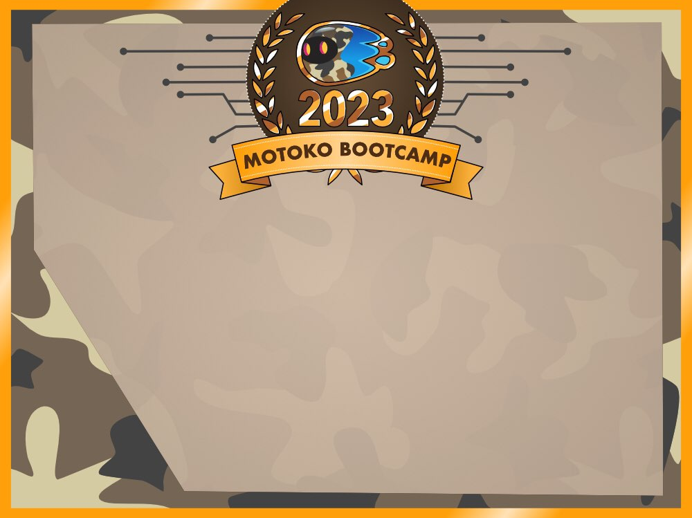

# Motoko Bootcamp - DAO Adventure - Graduation

<p align="center"></p>

> This repository correspond to the graduation phase of the DAO Adventure. To check out the complete DAO Adventure repository, [click here](https://github.com/motoko-bootcamp/dao-adventure).

## Important resources 📌

- [Motoko Bootcamp Dashboard](https://www.motokobootcamp.com/) (Click on **Login** to access)
- [Motoko Bootcamp Discord](https://discord.gg/qEF2W3dBrd)
- [Graduation Notion Guide](https://tomahawkvc.notion.site/Motoko-Bootcamp-Graduation-f31b9b7a89ed434abf6a96510450ab36)
- [Graduation Video Guide] - COMING SOON

## Motivation 💭

A DAO, which stands for Decentralized Autonomous Organization, is a new type of organization (or company) that runs leveraging blockchain technology. This enables us to create more transparent, trusted and efficient organisations.

<p align="center"></p>

**DAOs** are the biggest innovation in the field of governance since the invention of the [LLC](https://www.investopedia.com/terms/l/llc.asp) or perhaps even democracy itself. Just like the **steam engine** made the **Industrial Revolution** possible by harnessing **physical powe**r, DAOs harness **political power** and make a Web3 revolution possible. This could fundamentally change how we organize resources, people and capital with the end goal of creating a more stable, flourishing, collaborative and fair civilisation.

## Mission 🎯

This future is only possible if enough builders stand up to make the dream a reality. Your goal, if you wish to earn your **Motoko Bootcamp Diploma**, is to build a simple DAO. <br/>

<p align="center"></p>

Based on all the knowledge you've acquired during your training, you should be able to build, from scratch, a project that follows the necessary requirements.

## **How to get started?** 🚀

You have two available options:

1. Run this repository directly in your browser. This is the easiest way to get started. You can do so by clicking on the following button:

   > [](https://gitpod.io/#https://github.com/motoko-bootcamp/dao-adventure-graduation)

> GitPod is a cloud-based development environment. We will use it to access and edit the project files directly from the web browser. That way you don’t have to install any additional software or worry about setting up your development environment locally. If you are facing issues with GitPod try the followings: Switch to another browser (Firefox is recommended) | Empty your cache and do a hard reset | Use Incognito Mode.

2. Run this repository locally. You'll need to install the [DFINITY Canister SDK](https://sdk.dfinity.org/docs/quickstart/local-quickstart.html) to do so and setup your environment. You can find a detailed guide on how to do so [here](https://www.youtube.com/watch?v=DTDP7WYU07w). Then simply download this repository and open it in your favorite IDE.

## Requirements 👨‍🏫

1. **Double canisters**: this project is made up of two different canisters.

- The **Webpage** canister - this canister serves a webpage.
- The **DAO** canister - this canister manages the member of the DAO, the voting system, the manifesto and the goals of the DAO.

2. **Membership and Token Allocation**:

- New members receive 10 Motoko Bootcamp Tokens (MBT) upon joining.
- MBTs are used for participating in DAO activities.

3. **Role System**:

- The DAO comprises three roles: **Students**, **Graduates**, and **Mentors**.
- **Students**: All members start as students. They are members who haven't completed the Motoko Bootcamp.
- **Graduates**: These are members who have completed the Motoko Bootcamp. They gain the right to vote on proposals. Any member can become a Graduate through a `graduate` function, which only a **Mentor** executes. There's no need to implement a verification process for this.
- **Mentors**: Graduates who are selected by the DAO become **Mentors**. They can both vote on and create proposals. An existing **Mentor** can assign the **Mentor** role to any **Graduate** member by creating a proposal. This proposal has to be approved by the DAO.

4. **Proposal Creation**

- Only **Mentors** are authorized to create proposals.
- To create a proposal, a **Mentor** must burn 1 MBT, which decreases their token balance.

5. **Voting System**:

- Only **Graduates** and **Mentors** are allowed to vote.
- The voting power of a member is determined as follows:

  - If the member is a **Student** - the voting power is set to 0 (**Student** doesn't have voting power).
  - If the member is a **Graduate** - his voting power is directly equal to the number of MBC token they hold at the moment of voting.
  - If the member is a **Mentor** - his voting power is equal to 5x the number of MBC token they hold at the moment of voting.

- The `yesOrNo` field of the `Vote` object is a `Bool` representing whether a vote is meant to approve or refuse a proposal. `true` represents a vote in favor of a proposal and `false` represents a vote against a proposal.
- When a member votes on a proposal, his voting power is added or substracted to the `voteScore` variable of the `Proposal` object.
- A proposal is automatically accepted if the `voteScore` reaches 100 or more. A proposal is automatically rejected if the `voteScore` reaches 100 or less. A stays open as long as it's not approved or rejected.
- Approved proposals are automatically executed.

> For instance if a mentor with a token balance of 15 MBC votes on a proposal with a `true` vote - 75 will be added to the `voteScore`. Assuming the `voteScore` was originally at 30, the `voteScore` is now at 105 and the proposal is accepted and executed.

6. **Proposal Types**

They are 3 types of proposal:

- `ChangeManifesto`: those proposals contain a `Text` that if approved will be the new manifesto of the DAO. If the proposal is approved the changes should be reflected on the **DAO** canister and on the **Webpage** canister.
- `AddGoal`: those proposals contain a `Text` that if approved will be added to the goals of the DAO. If the proposal is approved the changes should be reflected on the **DAO** canister and on the **Webpage** canister.
- `AddMentor`: those proposals contain a `Principal` that if approved will be come a mentor of the DAO. Whenever such a proposal is created, we need to verify that the specified principal is a **Graduate** of the DAO, as only **Graduate** can become **Mentors**. If the proposal is approved the changes should be reflected on the **DAO** canister.

7. **Initial Setup**:
   The initial setup of the DAO should include an initial mentor to ensure that theo DAO is operational:

- **Mentor**:
  - Name: **Motoko Bootcamp**
  - Associated Principal: `gth2f-eyaaa-aaaaj-qa2pq-cai` (Canister ID of the dashboard).

> You can decide to hardcode the initial setup or create an external that will be executed canister upon deployment.

8. **Token Faucet**

You are required to use the **Motoko Bootcamp Token**, a free, educational token faucet. It allows unlimited minting but holds no real economic value; it's solely for educational use.

Find the token faucet source code in the [token_faucet](./src/token_faucet/main.mo) folder of this repository. Deploy it locally for building and testing. For your live project on the **Internet Computer**, your are required to use the existing token faucet on the **Internet Computer** with the canister ID `jaamb-mqaaa-aaaaj-qa3ka-cai`.

Access the interface of the deployed token faucet canister [here](https://dashboard.internetcomputer.org/canister/jaamb-mqaaa-aaaaj-qa3ka-cai).

You'll need to use the Faucet canister to:

- Mint tokens when a new member joins your DAO.
- Burn tokens when a new proposal is created.

9. **Stable Structure**

Your project will make use of stable data-structures. The aim is to ensure that your DAO can be upgraded in the future without losing any data.

## Types ⚙️

All the necessary types are defined in the [types.mo](./src/types.mo) file.

## Interface (DAO) 📺

The interface of your **DAO** canister should **strictly** respect the following:

```motoko
actor {
    getIdWebpage : shared query () -> async Principal;
    getName : shared query () -> async Text;
    getManifesto : shared query () -> async Text;
    registerMember : shared (name : Text) -> async Result<(),Text>;
    getMember : shared query (p : Principal) -> async Result<Member,Text>;
    getStats : shared query () -> async Stats;
    graduate : shared (student : Principal) -> async Result<(),Text>;
    createProposal : shared (content : ProposalContent) -> async Result<ProposalId,Text>;
    getProposal : shared query (id : ProposalId) -> async Result<Proposal,Text>;
    getAllProposals : shared query () -> async [Proposal];
    voteProposal : shared (proposalId : ProposalId, vote : Vote) -> async Result<(),Text>;
}
```

## Interface (Webpage) 📺

The interface of your **Webpage** canister should **strictly** respect the following:

```motoko
actor {
    getManifesto : shared query () -> async Text;
    setManifesto : shared (manifesto : Text) -> async Result<(), Text>;
    getGoals : shared query () -> async [Text];
    addGoal : shared (goal : Text) -> async Result<(), Text>;
    http_request : shared query (request : HttpRequest) -> async HttpResponse;
}
```

## How to submit your project 📬

Head over to the [Motoko Bootcamp Dashboard](https://www.motokobootcamp.com/), section **Submit**, **Graduation** and input your canister ID. You should submit the canister ID of your **DAO** canister.

Upon submitting your project, to determine if you have gratuated or not, a few tests will be automatically performed on your **DAO canister**. Those tests will take between 20 and 30 seconds.

1. Do not interact with the **DAO** canister during the testing phase.
2. Strictly respect the interface and types that are defined and provided in this repository. Any modification will result in a failed test.
3. If your test fails without prompting an error message or loads for more than 1 minute, open your browser inspector, click on at the developer console, take a screenshot and report the issue on our [feedback channel].

## Benefits of Graduation 🎓

Your Motoko Bootcamp diploma will grant you the following lifetime benefits:

- Access to a dedicated Motoko Bootcamp Graduate Channel on **OpenChat**.
- Access to a dedicated Motoko Bootcamp Portal on **DSCVR**.
- Access to the **Motoko Bootcamp Manifesto**.
- Possible participation in future **Bootcamps**.
- Additional benefits to be announced.

> **The Motoko Bootcamp Diploma and the associated on-chain infrastructure are still under development. We will keep you updated on the progress.**

## **Credits** 🙏

An initiative powered and 100% supported by [Code & State](https://www.codeandstate.com/) - the leading Web3 venture studio for the Internet Computer.
